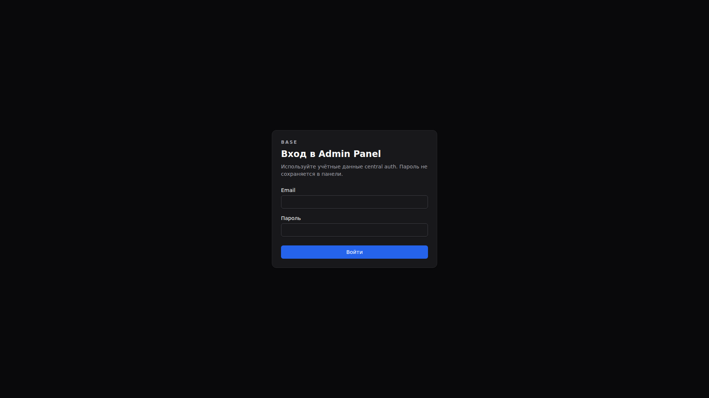
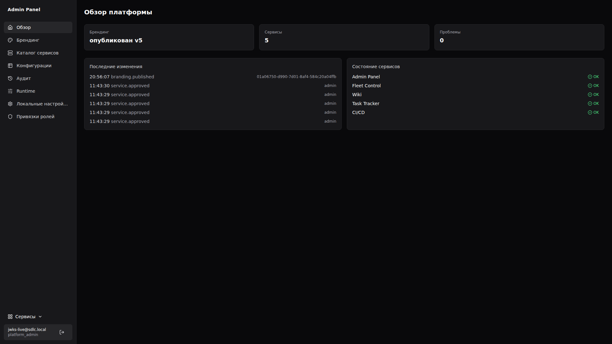
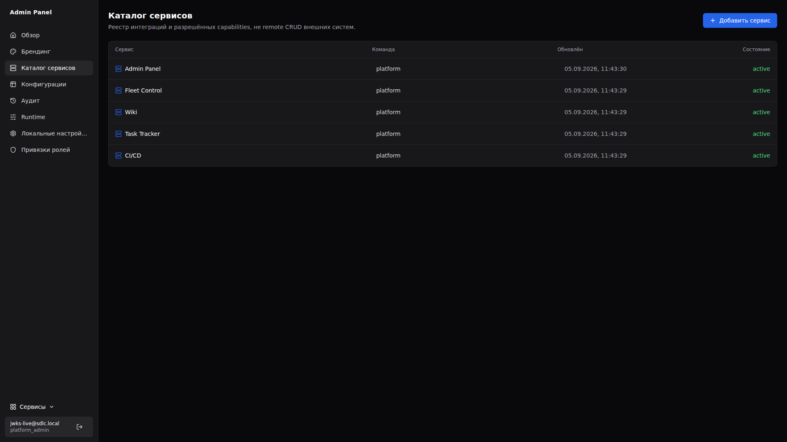
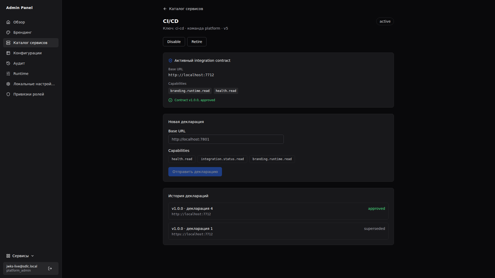
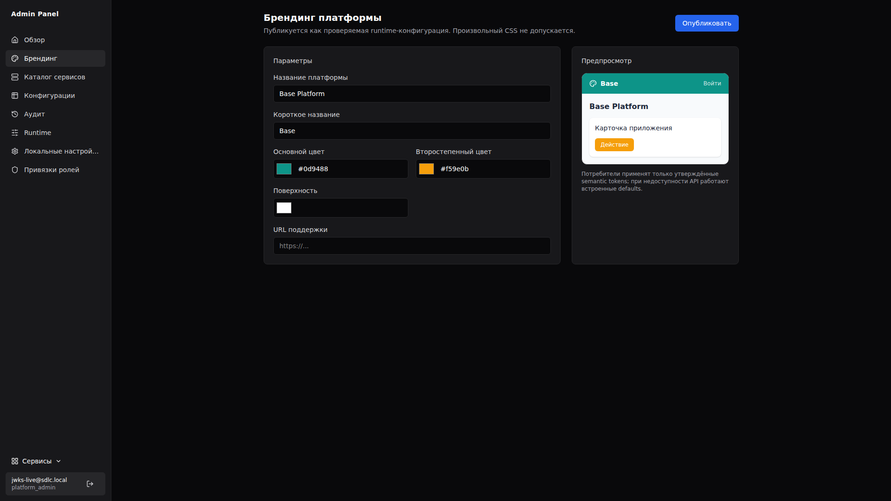
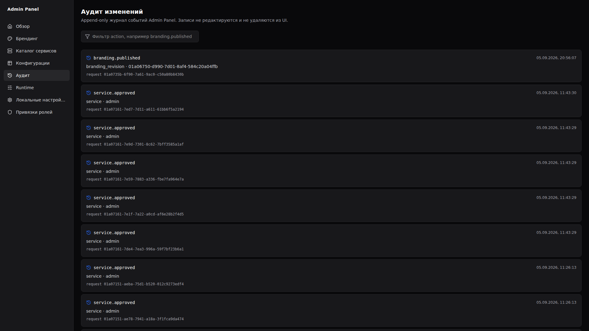
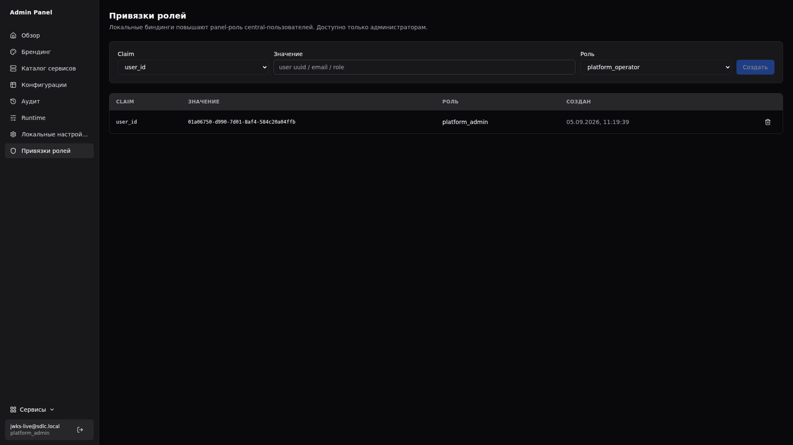
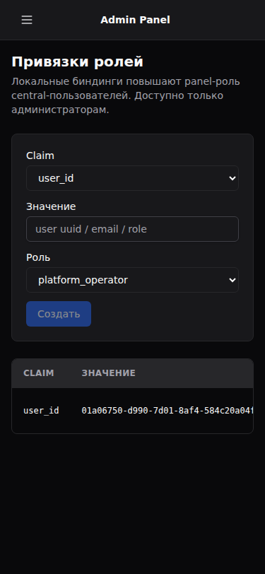

# Admin Panel

Панель управления платформой Base: центральный брендинг, каталог сервисов, интеграции и аудит. Реализация v1 запущена и работает в локальном зонтичном стенде.

## Возможности

- **Central auth интеграция** — вход по учётным данным central auth (7701) через login-прокси; ES256/JWKS-валидация, fail-closed мутации, panel-роли (`platform_viewer` / `platform_operator` / `platform_admin`) с локальными elevation-биндингами.
- **Брендинг платформы** — ревизии документов брендинга (draft → published), ETag-кэширование, публикация в runtime для всех UI платформы.
- **Каталог сервисов** — реестр интеграций: декларации с версиями, capabilities (`health.read`, `branding.runtime.read`, `integration.status.read`), approve-флоу, disable/retire, публичный `GET /api/v1/runtime/services` для сервис-свитчера.
- **Аудит** — append-only журнал всех мутаций с реальным actor identity и ролью.
- **Привязки ролей** — локальные биндинги claim → panel-роль (admin-only).

## Стек

Rust 2024 (Axum 0.8, SQLx 0.8, PostgreSQL 17) · React 19, Vite, Tailwind, shadcn-style UI (`@sdlc/ui`) · Docker Compose.

## Топология

| Порт | Назначение |
| --- | --- |
| `7701` | Central auth (внешняя зависимость, JWKS `http://auth:7701/oidc/jwks`) |
| `7771` | API Admin Panel |
| `7772` | Веб-интерфейс Admin Panel |
| `7773` | PostgreSQL Admin Panel |

## Интерфейс

### Вход в Admin Panel



Аутентификация через central auth; пароли не хранятся панелью.

### Обзор платформы



Сводка: состояние сервисов, опубликованный брендинг, последние события аудита.

### Каталог сервисов



Реестр интеграций платформы с создание сервисов и деклараций.

### Карточка сервиса



Активный контракт, история деклараций, approve/disable/retire.

### Брендинг



Черновик → публикация ревизии; применяется во всех UI платформы через ETag-кэш.

### Аудит изменений



Append-only журнал: action, actor, роль, сущность.

### Привязки ролей



Локальные elevation-биндинги central-пользователей (admin-only).

### Мобильная версия

Каталог и привязки ролей адаптированы под 375×812: карточный layout, гамбургер-меню.




Таблица привязок на узком экране намеренно компактна; полные данные доступны на desktop.

## API

Публичный контракт: [`openapi/openapi.json`](openapi/openapi.json) (OpenAPI 3.1, генерируется `cargo run -p admin-panel-api --bin gen-openapi`, CI проверяет актуальность).

- Публичные: `GET /api/v1/runtime/{branding,services}` (ETag, max-age=60), `GET /health/{live,ready}`, `POST /api/v1/auth/login`
- Авторизованные: `GET /api/v1/auth/me`, CRUD `/api/v1/services` (+`/approve`, `/disable`, `/retire`), `/api/v1/branding/revisions` (+`/publish`), `GET /api/v1/audit-events`, CRUD `/api/v1/role-bindings`
- Роли: мутации сервисов/брендинга — operator+, биндинги — admin; anon → 401, без прав → 403.

## Запуск

Локальный стенд — через зонтичный compose флота (`/opt/dev/sdlc/docker-compose.local.yml`):

```bash
cd /opt/dev/sdlc
docker compose -f docker-compose.local.yml up -d --build admin-api admin-web
```

Переменные окружения — в [`.env.example`](.env.example); детали — [`docs/LOCAL_SETUP.md`](docs/LOCAL_SETUP.md).

## Тесты

```bash
# backend (в контейнере rust:1.88): fmt + clippy -D warnings + test workspace
# frontend
cd frontend && pnpm test        # vitest
cd frontend && pnpm test:e2e    # playwright (chromium), моки API
```

## Документация

- [`docs/ADR_INDEX.md`](docs/ADR_INDEX.md) — архитектурные решения
- [`docs/plans/`](docs/plans/) — планы объёмов работ
- [`CHANGELOG.md`](CHANGELOG.md)
