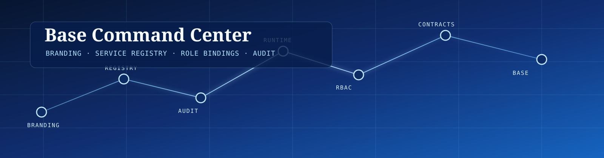
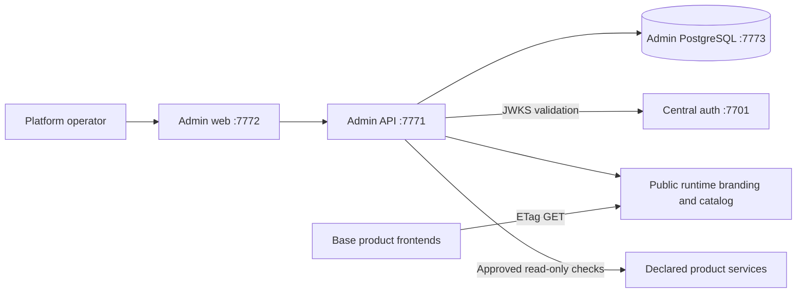
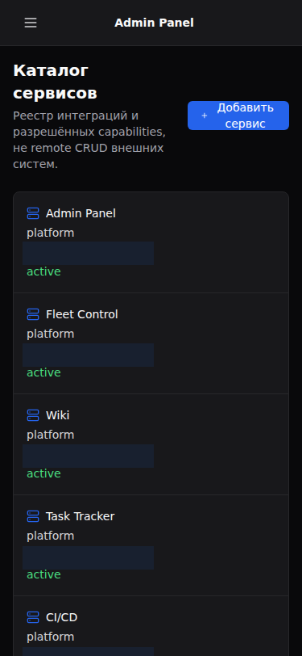

<p align="center">
  
</p>

<p align="center">
  <a href="#features"></a>
  <a href="#quick-start"></a>
  <a href="#boundaries"></a>
  <a href="#architecture"></a>
  <a href="#quality"></a>
</p>

<p align="center">
  
  
  
  
  
  
</p>

---

## Позиционирование

**Admin Panel** — ограниченный control plane Base. Он владеет версионируемым брендингом, реестром интеграций, локальными role bindings и append-only audit. Он не заменяет продуктовые сервисы и не становится generic remote-administration gateway.

Панель публикует только безопасные runtime-контракты для consumers: branding и active service catalog с ETag и `max-age=60`. Каждый продукт сохраняет доменные данные, API, secrets, availability и собственную authorization policy.

<a name="features"></a>

## Возможности

| Surface | Текущий контракт |
|---|---|
| Branding revisions | Draft → published → withdrawn flow, immutable revision history, optimistic concurrency и audit. |
| Runtime branding | Public `GET /api/v1/runtime/branding`, ETag, `Cache-Control: max-age=60` и safe presentation projection. |
| Service registry | Версионируемые integration declarations, capability allowlist, approve, disable, retire и bounded read-only checks. |
| Runtime catalog | Public `GET /api/v1/runtime/services` выдаёт только `active` services с approved declaration для межпродуктовой навигации. |
| Role bindings | Локальная elevation policy verified `user_id`, `email` или `role` claim → panel role; управление доступно только `platform_admin`. |
| Audit | Append-only events для approved/reported service operations и branding publication/withdrawal; registry creation/update/status и role-binding mutations пока не имеют complete audit coverage. |

## Snapshot

| Поле | Значение |
|---|---|
| Backend | Rust 2024, Axum 0.8, SQLx 0.8, PostgreSQL 17 |
| Frontend | React 19, TypeScript 5.9, Vite, Tailwind, `@sdlc/ui` |
| Auth contract | External central auth, ES256 bearer validation через JWKS, fail-closed mutations |
| Local panel roles | `platform_viewer`, `platform_operator`, `platform_admin` |
| Umbrella endpoints | API `http://127.0.0.1:7771`, web `http://127.0.0.1:7772`, PostgreSQL `127.0.0.1:7773` |
| Public runtime APIs | `/api/v1/runtime/branding`, `/api/v1/runtime/services` |
| API contract | [OpenAPI 3.1](openapi/openapi.json), CI detects generated-spec drift |

<a name="quick-start"></a>

## Быстрый старт

### Base umbrella

Административный API и web запускаются в общем Compose Base. Secrets остаются в private deployment environment; не подставляйте их в shell history, README examples или Git.

```bash
docker compose -f docker-compose.local.yml up -d --build admin-api admin-web
curl --fail http://127.0.0.1:7771/health/ready
curl --fail http://127.0.0.1:7772/
```

### Локальная разработка

В репозитории есть отдельный `docker-compose.dev.yml` с API `7771`, web `7772` и PostgreSQL `7773`. Перед запуском создайте локальный `.env` из [`.env.example`](.env.example), задайте значения только вне Git и следуйте [Local Setup](docs/LOCAL_SETUP.md).

```bash
docker compose -f docker-compose.dev.yml up -d --build
curl --fail http://127.0.0.1:7771/health/ready
```

<a name="boundaries"></a>

## Границы владения

| Владелец | Владеет | Явно не владеет |
|---|---|---|
| Admin Panel | Branding revisions, service registry, runtime catalog, local role bindings, panel audit | Product domain records, product DBs, arbitrary remote execution |
| Central auth | Identity, credentials, token issuance, signing keys и JWKS | Branding, registry, audit и Admin Panel policy |
| Product services | Domain data, product authorization, local availability, secrets и service APIs | Central platform branding mutation и global registry policy |
| Platform operator | Deployment secrets, CORS/allowlist policy, backup и signing-key lifecycle | User credentials в source control |

Central auth остаётся внешним identity service. `POST /api/v1/auth/login` проксирует credentials и возвращает session response только после validation token; Admin Panel не сохраняет passwords, access tokens или refresh tokens. API валидирует ES256 bearer token через configured JWKS и накладывает собственную panel-role policy. Unknown/missing central role остаётся least-privilege viewer; local binding сопоставляет verified central `user_id`, `email` или `role` claim только для этой панели.

<a name="architecture"></a>

## Архитектура



| API class | Auth | Role / contract |
|---|---|---|
| `/health/{live,ready}` | None | Process and owned-store readiness only. |
| `/api/v1/runtime/{branding,services}` | None | Safe public projection; no credentials or diagnostics. |
| `/api/v1/auth/me` | Bearer | Validated caller identity and effective panel capabilities. |
| Registry, branding, audit | Bearer | `platform_operator` or above. |
| Role bindings | Bearer | `platform_admin` only. |

Integration checks are intentionally bounded: the caller chooses a declared capability, while server code chooses the fixed path and method from a local allowlist. The API is neither a proxy nor a remote shell.

<a name="evidence"></a>

## Интерфейс

### Вход


### Обзор платформы


Единая operational view: published branding, registry count, problem count, recent audit events и состояние сервисов. Screenshot uses safe evidence data; real personal identifiers, tokens and secrets are never part of README evidence.

### Каталог сервисов


### Карточка сервиса


### Привязки ролей


Версионируемый registry отделяет integration declaration от произвольного управления внешними сервисами: только approved capabilities получают bounded read-only checks.

### Брендинг и аудит


Publication меняет только управляемый versioned document. Audit evidence доступен для approved/reported service operations и branding publication/withdrawal; создание/изменение registry, service status и role bindings остаются явным coverage gap до отдельного audit-closure изменения.

### Mobile evidence

 

Mobile viewport — `375×812`: sidebar collapses to a menu and service registry switches to touch-friendly cards. Role-binding data remains intentionally compact on narrow screens; full comparison stays available on desktop.

<a name="quality"></a>

## Качество

```bash
# README invariants
python3 -m unittest scripts.tests.test_verify_readme
python3 scripts/verify_readme.py

# Frontend
cd frontend
pnpm install --frozen-lockfile
pnpm lint
pnpm typecheck
pnpm test
pnpm build

# Backend: documented Rust 1.88 container gate
cd ..
docker run --rm \
  -v "$PWD:/workspace" -v "$(dirname "$PWD")/services-base:/services-base:ro" \
  -w /workspace/backend rust:1.88-bookworm \
  sh -lc 'cargo fmt --all -- --check && cargo clippy --workspace --all-targets -- -D warnings && cargo test --workspace'

# Compose syntax
docker compose -f docker-compose.dev.yml config -q
```

GitHub Actions executes independent backend, frontend and Compose-config gates. It also regenerates OpenAPI and fails if [openapi/openapi.json](openapi/openapi.json) drifts. Browser E2E runs locally when needed. The README gate validates local links, images, explicit navigation anchors, placeholders, local paths and CI badge workflow references.

## Security Boundary

- Private signing keys, database credentials, tokens, cookies and external integration secrets stay out of Git, docs, screenshots, runtime branding and audit rows.
- ES256/JWKS validation is fail-closed for protected endpoints; UI visibility is not an authorization boundary.
- Integration URLs and capabilities use strict validation and allowlists; user input cannot supply arbitrary external path, method, headers or body.
- Consumers retain local UI defaults: Admin Panel downtime does not prevent a product frontend from rendering.

## References

- [Architecture](docs/ARCHITECTURE.md)
- [API contract](docs/API.md)
- [Security boundary](docs/SECURITY.md)
- [Local setup](docs/LOCAL_SETUP.md)
- [Runtime contract](docs/RUNTIME.md)
- [Architecture decisions](docs/ADR_INDEX.md)
- [README implementation plan](docs/plans/2026-09-18-readme-reference-implementation.md)
