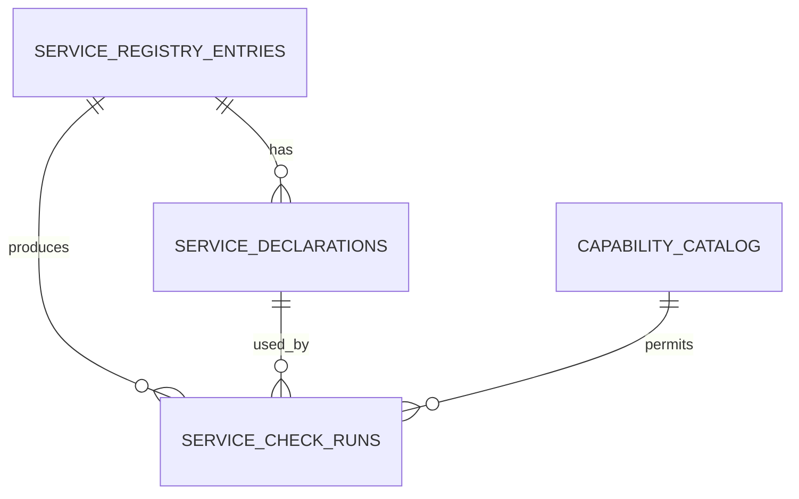

# Дата-модель SDLC Admin Panel

## 1. Принципы

- PostgreSQL на порту `7773` хранит только данные Admin Panel.
- Идентификаторы сущностей — UUID; временные поля — `timestamptz` в UTC.
- Конфигурационные документы хранятся в `jsonb` только после строгой schema-validation на уровне приложения.
- Нет внешних FK в базы central auth или SDLC-сервисов.
- Секреты, access/refresh-токены, private keys, пароли и произвольные HTTP headers не являются данными этой модели.
- Изменения бизнес-сущностей и audit event коммитятся в одной транзакции.

## 2. Сущности

| Сущность | Назначение | Владелец |
|---|---|---|
| `service_registry_entries` | Каноническая текущая запись об интегрируемом сервисе. | Admin Panel |
| `service_declarations` | Неизменяемые ревизии деклараций endpoint/capabilities. | Admin Panel, содержание декларирует сервис |
| `service_check_runs` | История ограниченных read-only проверок одобренных интеграций. | Admin Panel |
| `capability_catalog` | Локальный allowlist поддерживаемых capabilities. | Admin Panel |
| `branding_revisions` | Черновые и опубликованные versioned документы бренда. | Admin Panel |
| `role_bindings` | Сопоставление утвержденных auth claims с ролями панели. | Admin Panel |
| `audit_events` | Неизменяемый след административных событий. | Admin Panel |

## 3. Таблицы

### 3.1. `service_registry_entries`

Текущая операторская карточка сервиса. Запись не является копией конфигурации сервиса.

| Поле | Тип | Ограничение/назначение |
|---|---|---|
| `id` | UUID PK | Идентификатор записи. |
| `service_key` | varchar(64) | UNIQUE; lowercase kebab-case, например `task-tracker`. |
| `display_name` | varchar(160) | Имя для панели. |
| `owner_team` | varchar(160) | Ответственная команда, не персональные credentials. |
| `status` | varchar(16) | `pending`, `active`, `disabled`, `retired`. |
| `active_declaration_id` | UUID nullable | FK на одобренную ревизию декларации. |
| `created_at` | timestamptz | Создание. |
| `updated_at` | timestamptz | Последнее изменение. |
| `version` | bigint | Optimistic concurrency. |

Ограничение: `status = active` допустим только при непустом `active_declaration_id`, ссылающемся на одобренную декларацию этого же `service_key`.

Индексы: UNIQUE (`service_key`), (`status`, `updated_at DESC`), (`owner_team`).

### 3.2. `service_declarations`

Версионируемый контракт, заявленный сервисом и утверждаемый оператором.

| Поле | Тип | Ограничение/назначение |
|---|---|---|
| `id` | UUID PK | Ревизия декларации. |
| `registry_entry_id` | UUID FK | `service_registry_entries.id`, `ON DELETE RESTRICT`. |
| `declaration_version` | integer | Версия формата декларации; поддерживается только allowlist версий. |
| `integration_base_url` | text | Нормализованный HTTPS origin без userinfo/query/fragment. |
| `capabilities` | jsonb | Массив ключей из `capability_catalog`; без параметризованных URL. |
| `service_contract_version` | varchar(64) | Версия контракта, публикуемая сервисом. |
| `declared_by_subject` | varchar(255) | `sub` актора/сервиса; без токена. |
| `declared_at` | timestamptz | Момент подачи. |
| `approval_status` | varchar(16) | `pending`, `approved`, `rejected`, `superseded`. |
| `approved_by_subject` | varchar(255) nullable | `sub` администратора. |
| `approved_at` | timestamptz nullable | Момент решения. |
| `rejection_reason` | varchar(500) nullable | Без чувствительных деталей. |
| `content_hash` | char(64) | SHA-256 canonical payload для dedup/аудита. |

Индексы: UNIQUE (`registry_entry_id`, `content_hash`), (`registry_entry_id`, `declared_at DESC`), (`approval_status`, `declared_at DESC`).

`capabilities` валидируется приложением и DB check: это JSON array непустых строк; полная семантика allowlist проверяется приложением по `capability_catalog`.

### 3.3. `capability_catalog`

| Поле | Тип | Назначение |
|---|---|---|
| `key` | varchar(80) PK | Например `health.read`. |
| `description` | text | Назначение capability. |
| `fixed_method` | varchar(8) | Только разрешенный HTTP method. |
| `fixed_path` | varchar(255) | Фиксированный относительный путь; не приходит от сервиса. |
| `is_active` | boolean | Доступна ли capability для новых деклараций. |
| `created_at` | timestamptz | Создание. |

В v1 seed-содержимое ограничено `health.read`, `integration.status.read`, `branding.runtime.read`. Это справочник продукта, а не UI-редактор произвольных удаленных действий.

### 3.4. `service_check_runs`

| Поле | Тип | Назначение |
|---|---|---|
| `id` | UUID PK | Идентификатор проверки. |
| `registry_entry_id` | UUID FK | Проверяемый сервис. |
| `declaration_id` | UUID FK | Ревизия, использованная проверкой. |
| `capability_key` | varchar(80) FK | Разрешенная capability. |
| `triggered_by_subject` | varchar(255) | Актор или `system`. |
| `started_at`, `finished_at` | timestamptz | Длительность. |
| `outcome` | varchar(16) | `success`, `unreachable`, `timeout`, `rejected`, `invalid_response`, `internal_error`. |
| `http_status` | smallint nullable | Только код ответа. |
| `summary` | varchar(500) | Санитизированный итог без response body. |
| `request_id` | UUID | Корреляция. |

Индексы: (`registry_entry_id`, `started_at DESC`), (`outcome`, `started_at DESC`). Полные request/response payload, redirect chain и заголовки не хранятся.

### 3.5. `branding_revisions`

| Поле | Тип | Ограничение/назначение |
|---|---|---|
| `id` | UUID PK | Идентификатор ревизии. |
| `revision` | bigint | UNIQUE, строго монотонная. |
| `state` | varchar(16) | `draft`, `published`, `superseded`, `withdrawn`. |
| `document` | jsonb | Строго валидный branding schema. |
| `document_hash` | char(64) | Canonical SHA-256. |
| `etag` | varchar(128) | UNIQUE, strong ETag опубликованного документа. |
| `created_by_subject` | varchar(255) | Актор. |
| `created_at` | timestamptz | Создание. |
| `published_by_subject` | varchar(255) nullable | Публикующий администратор. |
| `published_at` | timestamptz nullable | Публикация. |
| `based_on_revision` | bigint nullable | База черновика для optimistic concurrency. |

Уникальный partial index гарантирует не более одной строки `state = published`. Публикация выполняется транзакционно: прежний `published` становится `superseded`, новая revision — `published`.

Разрешенная schema `document`:

```json
{
  "product_name": "SDLC",
  "product_short_name": "SDLC",
  "logo_url": "https://public.example/logo.svg",
  "favicon_url": "https://public.example/favicon.ico",
  "support_url": "https://public.example/support",
  "primary_color": "#123456",
  "accent_color": "#234567",
  "surface_color": "#f5f5f0"
}
```

Пример иллюстрирует форму, не задает реальные deployment-значения. URL и цвета проходят строгую validation; дополнительные ключи запрещены.

### 3.6. `role_bindings`

| Поле | Тип | Назначение |
|---|---|---|
| `id` | UUID PK | Идентификатор. |
| `claim_name` | varchar(80) | Разрешенный claim, например `roles` или `groups`. |
| `claim_value` | varchar(160) | Значение claim. |
| `panel_role` | varchar(32) | `platform_viewer`, `platform_operator`, `platform_admin`. |
| `created_by_subject` | varchar(255) | Актор. |
| `created_at`, `updated_at` | timestamptz | Аудит времени. |

UNIQUE (`claim_name`, `claim_value`, `panel_role`). Нельзя создавать binding для `sub` отдельного пользователя как замену централизованного управления идентичностями без отдельного ADR.

### 3.7. `audit_events`

| Поле | Тип | Назначение |
|---|---|---|
| `id` | UUID PK | Идентификатор. |
| `occurred_at` | timestamptz | Время действия. |
| `request_id` | UUID | Корреляция запроса. |
| `actor_subject` | varchar(255) nullable | JWT `sub` или системный актор. |
| `actor_role` | varchar(32) nullable | Роль, примененная к действию. |
| `action` | varchar(100) | Allowlist: `service.declared`, `service.approved`, `branding.published` и т.п. |
| `entity_type` | varchar(64) | `service`, `service_declaration`, `branding_revision`, `role_binding`. |
| `entity_id` | UUID nullable | Идентификатор сущности. |
| `metadata` | jsonb | Санитизированный diff/контекст. |
| `source_ip` | inet nullable | При разрешенной operational policy. |

Индексы: (`occurred_at DESC`), (`entity_type`, `entity_id`, `occurred_at DESC`), (`actor_subject`, `occurred_at DESC`), (`action`, `occurred_at DESC`). Запись append-only: для runtime-роль API нет `UPDATE`/`DELETE` на audit events.

## 4. Связи



`branding_revisions`, `role_bindings` и `audit_events` независимы от внешних баз. Audit event логически ссылается на все агрегаты через `entity_type/entity_id`, чтобы аудит сохранялся после retirement сервиса.

## 5. Правила удаления и хранения

- `service_registry_entries` не удаляется физически через прикладной API; вывод из эксплуатации — `retired`.
- `service_declarations` не меняются и не удаляются после создания. Новая декларация supersede-ит старую.
- `branding_revisions` не переписываются; rollback создает/публикует новую ревизию с прежним документом.
- `audit_events` не редактируются. Срок хранения и legal hold задаются deployment policy позже, но не путем удаления отдельных строк из UI.
- Локальные данные Admin Panel не каскадируются в соседние сервисы и не требуют остановки этих сервисов.

## 6. Модель не содержит

Нельзя добавлять в эти таблицы: JWT, JWKS private key, пароль БД, client secret, API key, исходный Authorization header, cookie, содержимое секретов CI-CD, рабочие документы wiki, задачи task-tracker, состояние агентов fleet-control или данные auth-server.

## References

- `docs/ARCHITECTURE.md`
- `docs/API.md`
- `docs/MIGRATIONS.md`
- `docs/SECURITY.md`
