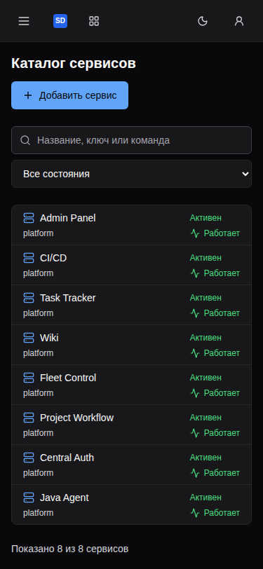
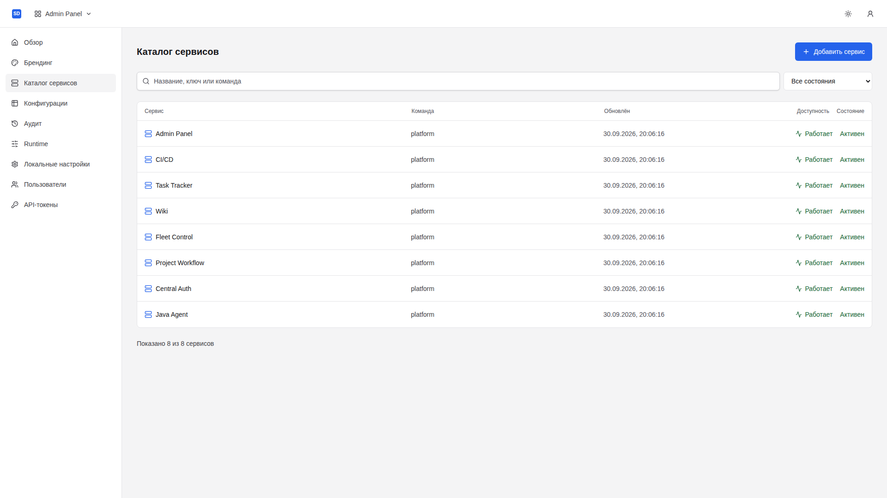
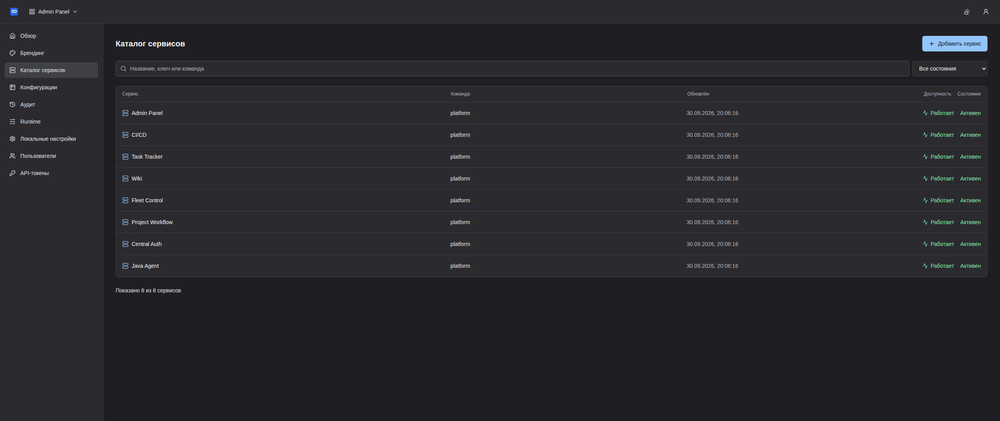
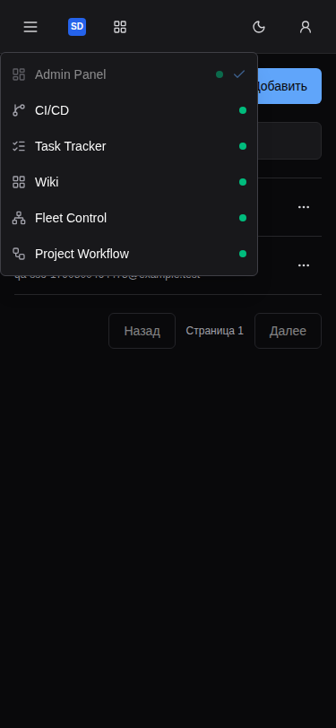

# Admin Panel: общий Header

Production nginx/Vite image, настоящий Central Auth и Admin API, отдельный
QA Compose-проект. Нет моков API и записи данных через Admin UI.
Base: `f7726b150b1d04c3ba2f96dc4900e544d8b22432` (общий UI #119).

## Приёмка

- Header: три реальные страницы, три темы, 11 ширин 320–2560 px — 99 сочетаний.
- Полная проверка Admin: десять маршрутов, три темы, четыре ширины — 120 сочетаний.
- Service detail: 54 проверки UI/API-only layout из отдельного versioned теста.
- Один прогон четырёх live-тестов: 4/4, без повторов и пропусков.
- Геометрия: Header 60 px на всю ширину, sidebar начинается под ним,
  цели действий 44 px на mobile / 40 px на desktop, без page overflow.
- Switcher: шесть UI в продуктовом порядке, все с реальным healthy;
  API-only и Pulse отсутствуют. Keyboard/touch/outside/Escape/focus проверены.
- Drawer: переходы, Escape, возврат фокуса и закрытие при desktop resize.
- Account: одна identity, выход через Central Auth, повторный вход требует пароль.
- Axe: нет serious/critical; нет console/request ошибок и Admin mutations.

`results.json` содержит машинный результат Header; отдельные существующие
live-тесты проверяют полные страницы и detail layout, а не только шапку.
Это приёмка данного изменения, не утверждение о завершении всего релиза SDLC.

## Скриншоты

Снимки full-page, реальные QA-данные. Открыты и визуально проверены перед
публикацией PR; QA credentials и browser storage не включаются в evidence.
