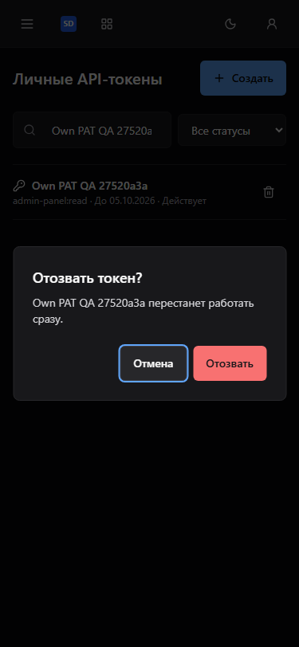
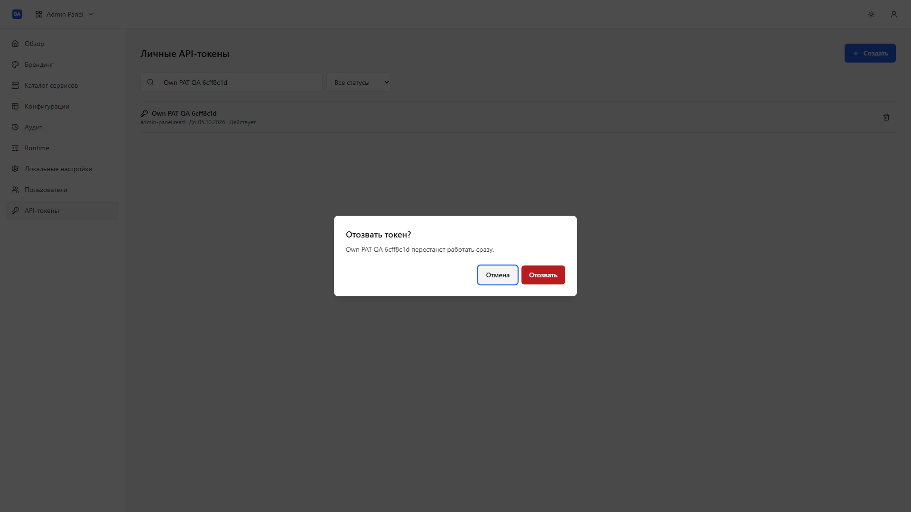
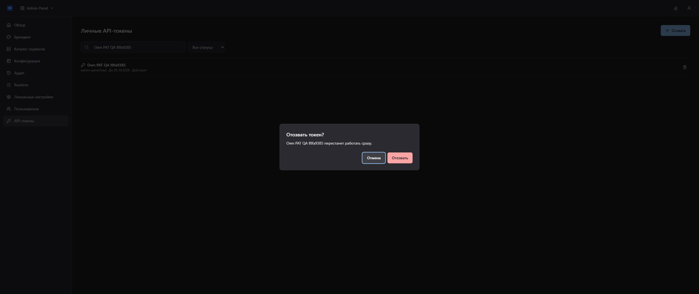

# Проверка подтверждения отзыва PAT

Production frontend собран штатным `frontend/Dockerfile.umbrella` из чистого
Git tree продукта и pinned Base `9408802dfa978cba2f67162a49adca6f65851b01`.
Временный Compose использовал собственные Central Auth, PostgreSQL и PAT;
доступ получен через реальный браузерный SSO/PKCE. API не подменялся.

Chromium / Playwright 1.61.1: 16 сценариев прошли. Двенадцать сочетаний ширин
375, 768, 1920, 2560 и dark/gray/light проверили viewport, начальный focus на
«Отмена», Tab trap, Escape, Cancel и возврат focus. Проверены реальная SQL
блокировка отзыва, запрет закрытия и дублирования при pending, ответ 204 и
readback `revoked_at`; реальный 404 с inline error и успешным retry; очистка
ошибки для другого PAT; исчезновение строки при active filter с возвратом
focus на «Создать». Блокировка занимает 5 секунд и сохраняет operational
timeout пересылки запроса. После проверки весь собственный QA Compose удалён.

Полные frontend гейты: 87 тестов, typecheck, lint/semantic checker, format,
build, OpenAPI drift/compatibility, packed Base consumer и effective-theme
проверка прошли на Node 26.10.0 / pnpm 10.28.1 с frozen lockfiles.
Backend/OpenAPI, Base pin, auth/scopes и зависимости не менялись.

Снимки содержат metadata собственных fixtures; секрет PAT не отображается.
Все три снимка открыты и визуально проверены.

Эта проверка относится к исправлению подтверждения PAT. Полная поставка
Base/продуктов и PM/native/Pulse проверяется отдельно.
