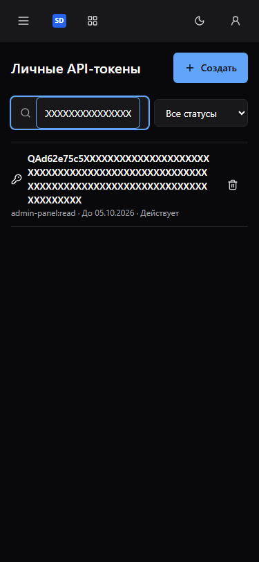
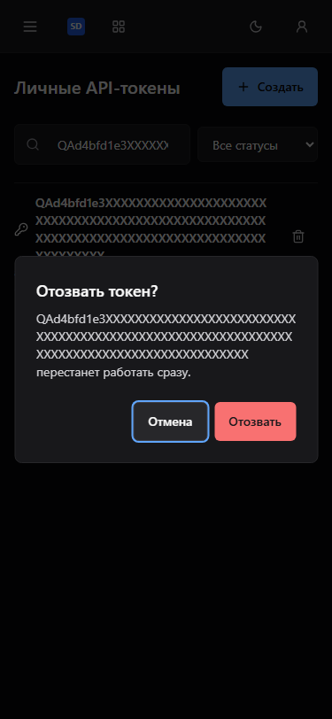
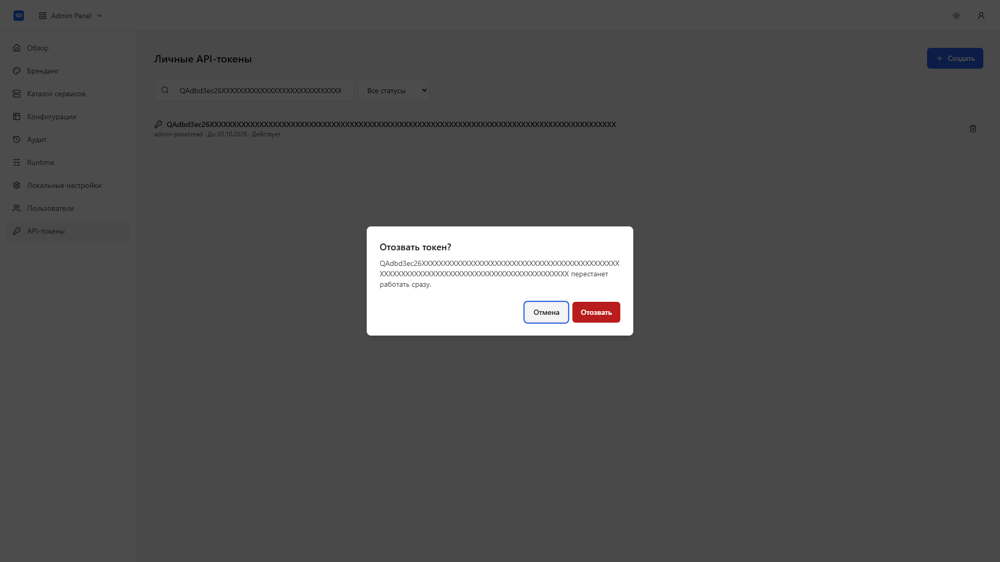

# Проверка максимальных имён PAT

Реальный API принимает имя длиной 100 символов. До исправления такое имя
без пробелов растягивало страницу до 887 px при viewport 375 px. Перенос
текста в flex item исправлен в Admin; границы API, auth и Base сохранены.

После исправления страница и body имеют ширину 375 px при viewport 375 px;
ConfirmDialog имеет client/scroll width 341 px. Имя читается полностью,
иконка и кнопка отзыва доступны. Текст не обрезается и не удаляется.

Production Dockerfile.umbrella собран из чистого staged Git tree и pinned
Base940. Chromium / Playwright 1.62.1: 17/17 реальных API
сценариев прошли без моков. Все fixtures имеют максимальные имена:
375/768/1920/2560 × dark/gray/light, геометрия страницы и диалога,
Cancel/Escape/Tab/focus, SQL-lock pending/204/readback, 404/retry,
очистка ошибки и active-filter disappearance. Отдельная регрессия
проверяет 100-символьное имя на 375 px. QA Compose удалён.

Полные frontend гейты, 87 тестов, OpenAPI/packed-consumer/effective-theme
проверки прошли с frozen lockfiles. Backend и HTTP/PAT scopes не менялись.
Снимки собственных metadata fixtures открыты и проверены; PAT secret
в UI не раскрывался. Полная поставка и итоговые три ревью проверяются отдельно.

